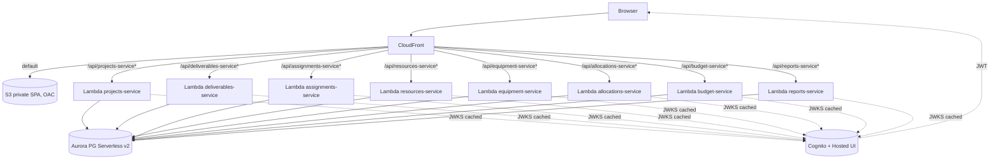
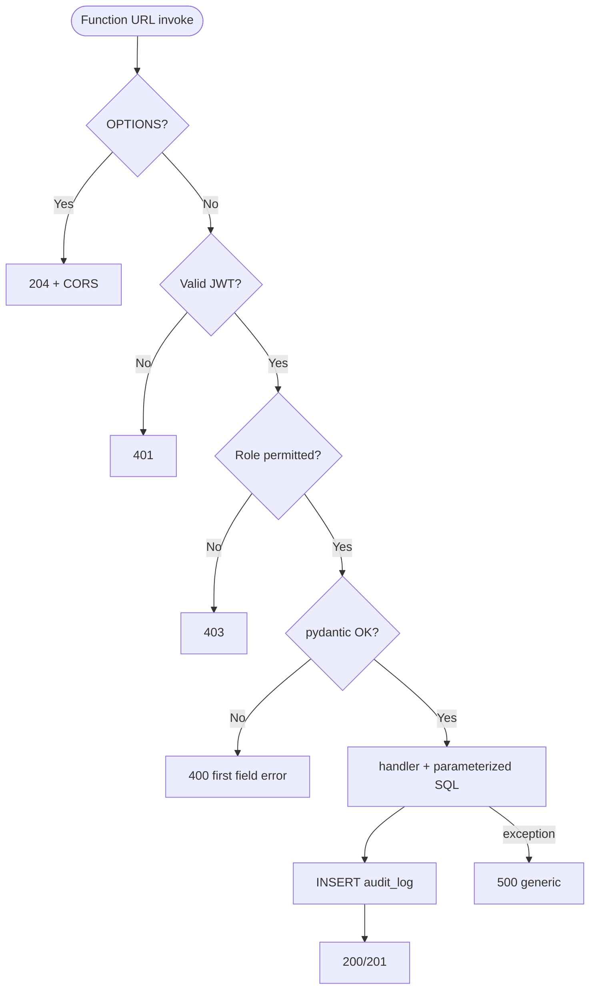
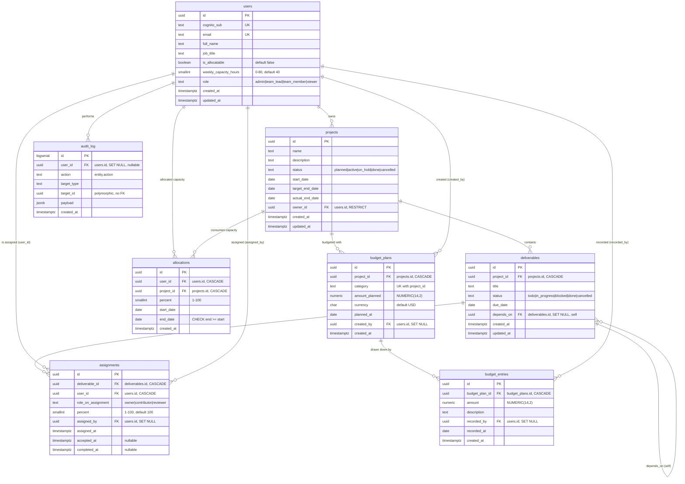

# SYSTEM_DESIGN — ACME Project Tracker
v1.1 · 2026-06-09
## 0. Directives (agent)
- Single source of truth. Adhere to §4 (stack), §6 (schema), §7 (API). No unlisted deps.
- All AWS resources via Terraform in `infra/`, deployed via `bin/*.sh`. No ClickOps, no `aws ... create-*`, no SDK provisioning. Drift = bug.
- **One Lambda per service.** `infra/locals.tf` auto-discovers `backend/<svc>/function.py` (1 level deep, no `_` prefix). Each = one `module "lambda"` + one Function URL + one CloudFront behavior at `/api/<svc>*`.
- **No web framework on Lambda** (no FastAPI/Flask/Django). It collapses routes into one Lambda and breaks the per-service URL model. Inside `function.py`, dispatch on `event["requestContext"]["http"]["method"]` + `event["rawPath"]`.
- If a requirement is ambiguous, stop and ask. Never invent schema, endpoints, or auth flows.
## 1. Project
| Field | Value |
|---|---|
| Name | ACME Project Tracker |
| Description | Internal web app for ACME PMs to track projects, deliverables, resources, and budgets. |
| Stakeholders | Admins, Team Leads, Team Members, Viewers (executives). |
| Out of scope v1 | External integrations (Jira, Slack, Workday); real-time / WebSockets; file attachments; time tracking; invoicing; multi-tenancy across companies. |
| Brief deviation | Workshop brief listed MUI as required; v1.1 omits it by user decision (Tailwind-only). All behavior-bearing widgets are hand-rolled — see §8 a11y rules and R-07. |
## 2. Roles
| Role | Permissions |
|---|---|
| `admin` | Full CRUD; user + role mgmt; only role that can DELETE projects. |
| `team_lead` | CRUD on own projects + their deliverables/allocations/budget; read all. |
| `team_member` | Read projects they're allocated to; PATCH `status` on deliverables assigned to them. |
| `viewer` | Read-only across all projects. |
One role per user in v1. Stored in `users.role`.
## 3. Functional requirements
- FR-01 Sign-in via Cognito Hosted UI (Authorization Code + PKCE).
- FR-02 Frontend stores no passwords; access tokens are Cognito JWTs; refresh handled by `oidc-client-ts` silent renew.
- FR-03 Every `/api/*` Lambda validates the Cognito JWT (iss + aud + exp + JWKS signature) before business logic. Anonymous → `401`.
- FR-04 RBAC per §2, enforced via `backend/_lib/auth.require_role(*roles)`.
- FR-05 CRUD for `projects`, `deliverables`, `assignments` (M:N deliverable↔user), `allocations` (project capacity), `budget_plans` + `budget_entries`. "Resources" is a view over `users WHERE is_allocatable=true` — no separate table.
- FR-06 Search: case-insensitive substring on `projects.name`, `deliverables.title`. Filters: `status`, `owner_id`, date range, `at_risk`.
- FR-07 Reports answer the 7 workshop questions: project status, at-risk (target_end_date < today+14 AND status ∉ ('done','cancelled')), allocation by user, deliverable completion % (computed from `assignments.completed_at`), over-allocated users (Σ `allocations.percent` > 100 in any overlapping window) + over-assigned users (Σ open `assignments.percent` > 100), deliverable dependency chain, budget consumed vs planned.
- FR-08 Responsive UI ≥ 360px and ≥ 1024px via Tailwind breakpoints (`sm`/`md`/`lg`); `react-responsive` for component-swap (JS-level conditional render where Tailwind’s CSS-only `hidden md:block` is insufficient).
## 4. Architecture
- **Frontend** — React 19 + Vite SPA → private S3 → CloudFront (OAC, SigV4). SPA fallback: 404 → `/index.html`.
- **Backend** — one Lambda per service, runtime `python3.11`, via `terraform-aws-modules/lambda/aws ~> 8.0`. Each exposes a Function URL (`authorization_type = NONE`; JWT enforced in-handler).
- **CloudFront** — same distribution; per-Lambda `ordered_cache_behavior` at `/api/<svc>*` with managed `CachingDisabled` + `AllViewerExceptHostHeader`. **Do not forward `Host`** — Function URL rejects it.
- **DB** — Aurora PostgreSQL Serverless v2, engine 17.7, `min_capacity = 0`, `max_capacity = 4` ACU, `storage_encrypted = true`, `backup_retention_period = 7`.
- **Networking** — default VPC public subnets. No NAT, no private subnets. Aurora ingress gated by ambient SG.
- **Local** — LocalStack + local Postgres. `bin/proxy-server.js` on :3001 fixes a LocalStack Function-URL CORS bug; Vite on :3000.
Not used: API Gateway, ECS, ALB, ElastiCache, DocumentDB.
### 4.1 Stack
| Layer | Tech | Notes |
|---|---|---|
| Frontend | React 19 + Vite 7 + **TypeScript 5.x (strict)** | `tsconfig.json` with `"strict": true`, `"noUncheckedIndexedAccess": true`. |
| UI | **TailwindCSS 4.x** via `@tailwindcss/vite` — sole design system | **Workshop brief originally mandated MUI; v1.1 omits it by user decision.** Trade-off: every dialog, menu, tabset, datagrid, snackbar, datepicker is hand-rolled. Accessibility (focus trap, ARIA, keyboard nav) is the author’s responsibility — see R-07 + §12 (Headless UI / Radix as a planned add). Tokens live in `tailwind.config.ts` (single source). Preflight **on** — standard Tailwind reset. |
| Responsive | `react-responsive` | required by brief; use for JS-level conditional render (e.g. `<Drawer>` vs `<BottomNav>` component swap). For pure show/hide, prefer Tailwind `hidden md:block`. |
| Routing | `react-router-dom` 7 | depends on CloudFront 404→index.html. |
| Auth client | `react-oidc-context` + `oidc-client-ts` | tokens in `sessionStorage`. Never `localStorage`. |
| HTTP | `fetch` + `src/services/apiClient.ts` | typed wrapper; injects `Authorization: Bearer …` from `useAuth()`. |
| Lint | ESLint 10 flat config + `typescript-eslint` | camelCase vars, PascalCase components, JSDoc on exported funcs. **PropTypes obsolete** under TS — use `interface Props`; supersedes the PropTypes rule in `.github/instructions/react.instructions.md` for v1.1. |
| Runtime | AWS Lambda, Python 3.11 | `function.handler(event, context)`. |
| Event shape | Function URL payload v2.0 | `event["requestContext"]["http"]["method"]`, `event["rawPath"]`. |
| Validation | `pydantic` v2 | `model_config = ConfigDict(extra="forbid")`. |
| DB driver | `psycopg[binary]` v3 | module-level conn reused across warm invocations. |
| Migrations | `backend/_db/migrations/NNN_*.sql` via `bin/migrate.sh` | no ORM. |
| Backend auth | `backend/_lib/auth.py` (PyJWT + cached JWKS) | validates `iss`, `aud`, `exp`, `token_use=access`, signature. |
| IdP | Cognito User Pool + Hosted UI | **not yet in `infra/` — add `infra/cognito.tf`**, see §10. |
| Hosting | S3 (private, OAC) + CloudFront | `infra/s3.tf`, `infra/cloudfront.tf`. |
| Compute | Lambda + Function URL | `infra/lambda.tf`. |
| DB | Aurora PG Serverless v2 | `infra/rds.tf`. |
| IaC | Terraform ≥ 1.5 | `infra/*.tf`. |
| Deploy | `bin/*.sh` | no CI in v1. |
| Local AWS | LocalStack Community | detected by `data.aws_caller_identity.this.id == "000000000000"`. |
### 4.2 Diagram

## 5. Modules
`backend/_lib/` (shared; `_` prefix excludes from discovery):
- `auth.py` — `verify_token(event)`, `require_role(*roles)`, `current_user(event)`.
- `db.py` — `get_conn()` module-level psycopg connection; resets on error.
- `http.py` — `ok/created/bad_request/unauthorized/forbidden/not_found/error`; `cors_headers()`; OPTIONS short-circuit.
- `validation.py` — pydantic base with `extra="forbid"`.
| Service | Endpoints | RBAC |
|---|---|---|
| `projects-service` | CRUD on `projects` | read: any · write: admin, team_lead · delete: admin |
| `deliverables-service` | CRUD on `deliverables` (incl. `?project_id=`); `depends_on` self-FK; **no longer carries an `assignee_id`** — assignments are a separate resource | read: any · write: admin, owning team_lead; `status` updatable by any user with an open `assignments` row on the deliverable |
| `assignments-service` | **NEW.** CRUD on `assignments` (many-to-many deliverable↔user); same table for team leads and team members — `role_on_assignment` differentiates `owner` / `contributor` / `reviewer` | read: any · create/delete: admin, owning team_lead · `accepted_at` / `completed_at` writable by the assignee themselves |
| `resources-service` | Manages staffing metadata on `users WHERE is_allocatable = true` (no separate table); reads project staffing | read: any · write: admin (sets `is_allocatable`, `job_title`, `weekly_capacity_hours`) |
| `equipment-service` | **NEW.** CRUD on `equipment` (free-form `kind` — any tangible asset). Tangible-asset resource type alongside people + deliverables. Approval workflow on team_member writes | read: any · create: any signed-in role (team_member forced `approval_status='pending'`) · update incl. approval: admin, team_lead · delete: admin (team_member may withdraw own pending) |
| `allocations-service` | CRUD on `allocations` (project-level capacity, distinct from deliverable-level assignments); warns on over-allocation, never blocks. Approval workflow on team_member self-requests | read: any · admin/lead write: auto-approved · team_member self-request: `user_id` forced to self, `approval_status='pending'`, lead/admin PATCH to approve/reject |
| `budget-service` | CRUD on `budget_plans` + append-only `budget_entries`; `GET` returns plan with computed `amount_consumed = SUM(entries.amount)` | read: any · create/delete plan: admin, owning team_lead · record entry: admin, owning team_lead |
| `reports-service` | GET `/at-risk`, `/over-allocated`, `/over-assigned`, `/allocation-by-user`, `/deliverable-completion`, `/budget-vs-planned`, `/deliverable-chain?project_id=` (project-status rollup uses `projects-service?status=…` instead — no dedicated report endpoint) | read: any |
### Request flow

## 6. Database
PG 17. DDL in `backend/_db/migrations/NNN_*.sql`. One PR = one migration.
Schema is **3NF**: one identity table (`users`) with an `is_allocatable` flag instead of a duplicate `resources` table; budget split into immutable plans + append-only entries (no "two facts in one row"); deliverable assignment is a true many-to-many via `assignments` (rows for team leads and team members are stored identically — role differentiated by `role_on_assignment`, not by table).
```sql
CREATE EXTENSION IF NOT EXISTS "pgcrypto";
CREATE EXTENSION IF NOT EXISTS "pg_trgm";   -- substring search (FR-06)
CREATE OR REPLACE FUNCTION trigger_set_updated_at() RETURNS TRIGGER AS $$
BEGIN NEW.updated_at = NOW(); RETURN NEW; END;
$$ LANGUAGE plpgsql;
-- Single identity table. `is_allocatable` flags users who can be staffed onto projects/deliverables
-- (replaces the former `resources` table; eliminates duplicated full_name/email rows).
CREATE TABLE IF NOT EXISTS users (
  id UUID PRIMARY KEY DEFAULT gen_random_uuid(),
  cognito_sub TEXT NOT NULL UNIQUE,
  email TEXT NOT NULL UNIQUE,
  full_name TEXT NOT NULL DEFAULT '',
  job_title TEXT NOT NULL DEFAULT '',
  is_allocatable BOOLEAN NOT NULL DEFAULT FALSE,
  weekly_capacity_hours SMALLINT NOT NULL DEFAULT 40 CHECK (weekly_capacity_hours BETWEEN 0 AND 80),
  role TEXT NOT NULL DEFAULT 'viewer'
    CHECK (role IN ('admin','team_lead','team_member','viewer')),
  created_at TIMESTAMPTZ NOT NULL DEFAULT NOW(),
  updated_at TIMESTAMPTZ NOT NULL DEFAULT NOW()
);
CREATE INDEX IF NOT EXISTS idx_users_email ON users(email);
CREATE INDEX IF NOT EXISTS idx_users_allocatable ON users(is_allocatable) WHERE is_allocatable;
CREATE OR REPLACE TRIGGER set_users_updated_at BEFORE UPDATE ON users
  FOR EACH ROW EXECUTE FUNCTION trigger_set_updated_at();
CREATE TABLE IF NOT EXISTS projects (
  id UUID PRIMARY KEY DEFAULT gen_random_uuid(),
  name TEXT NOT NULL,
  description TEXT NOT NULL DEFAULT '',
  status TEXT NOT NULL DEFAULT 'planned'
    CHECK (status IN ('planned','active','on_hold','done','cancelled')),
  start_date DATE,
  target_end_date DATE,
  actual_end_date DATE,
  owner_id UUID NOT NULL REFERENCES users(id) ON DELETE RESTRICT,
  created_at TIMESTAMPTZ NOT NULL DEFAULT NOW(),
  updated_at TIMESTAMPTZ NOT NULL DEFAULT NOW()
);
CREATE INDEX IF NOT EXISTS idx_projects_owner ON projects(owner_id);
CREATE INDEX IF NOT EXISTS idx_projects_status ON projects(status);
CREATE INDEX IF NOT EXISTS idx_projects_target_end ON projects(target_end_date);
-- Trigram GIN index for case-insensitive substring search (FR-06): ILIKE '%foo%'.
CREATE INDEX IF NOT EXISTS idx_projects_name_trgm ON projects USING gin (LOWER(name) gin_trgm_ops);
CREATE OR REPLACE TRIGGER set_projects_updated_at BEFORE UPDATE ON projects
  FOR EACH ROW EXECUTE FUNCTION trigger_set_updated_at();
-- Note: no `assignee_id` column. Assignments live in their own many-to-many table.
-- `cancelled` mirrors projects.status so a cancelled project's deliverables can be archived.
CREATE TABLE IF NOT EXISTS deliverables (
  id UUID PRIMARY KEY DEFAULT gen_random_uuid(),
  project_id UUID NOT NULL REFERENCES projects(id) ON DELETE CASCADE,
  title TEXT NOT NULL,
  status TEXT NOT NULL DEFAULT 'todo'
    CHECK (status IN ('todo','in_progress','blocked','done','cancelled')),
  due_date DATE,
  depends_on UUID REFERENCES deliverables(id) ON DELETE SET NULL,
  created_at TIMESTAMPTZ NOT NULL DEFAULT NOW(),
  updated_at TIMESTAMPTZ NOT NULL DEFAULT NOW()
);
CREATE INDEX IF NOT EXISTS idx_deliverables_project ON deliverables(project_id);
CREATE INDEX IF NOT EXISTS idx_deliverables_status ON deliverables(status);
CREATE INDEX IF NOT EXISTS idx_deliverables_due ON deliverables(due_date);
CREATE INDEX IF NOT EXISTS idx_deliverables_title_trgm ON deliverables USING gin (LOWER(title) gin_trgm_ops);
CREATE OR REPLACE TRIGGER set_deliverables_updated_at BEFORE UPDATE ON deliverables
  FOR EACH ROW EXECUTE FUNCTION trigger_set_updated_at();
-- Many-to-many between deliverables and users.
-- Treats team_lead and team_member rows identically; `role_on_assignment` is the only differentiator.
-- App rule (in _lib/auth): only users with users.role='team_lead' may hold role_on_assignment='owner'.
CREATE TABLE IF NOT EXISTS assignments (
  id UUID PRIMARY KEY DEFAULT gen_random_uuid(),
  deliverable_id UUID NOT NULL REFERENCES deliverables(id) ON DELETE CASCADE,
  user_id UUID NOT NULL REFERENCES users(id) ON DELETE CASCADE,
  role_on_assignment TEXT NOT NULL
    CHECK (role_on_assignment IN ('owner','contributor','reviewer')),
  percent SMALLINT NOT NULL DEFAULT 100 CHECK (percent BETWEEN 1 AND 100),
  assigned_by UUID REFERENCES users(id) ON DELETE SET NULL,
  assigned_at TIMESTAMPTZ NOT NULL DEFAULT NOW(),
  accepted_at TIMESTAMPTZ,                       -- NULL until the assignee acknowledges
  completed_at TIMESTAMPTZ,                      -- NULL until the assignee marks it complete
  UNIQUE (deliverable_id, user_id, role_on_assignment)
);
CREATE INDEX IF NOT EXISTS idx_assignments_deliverable ON assignments(deliverable_id);
CREATE INDEX IF NOT EXISTS idx_assignments_user_open   ON assignments(user_id) WHERE completed_at IS NULL;
CREATE INDEX IF NOT EXISTS idx_assignments_user_role   ON assignments(user_id, role_on_assignment);
-- Project-level capacity allocation (independent of deliverable-level assignments).
-- Renamed from resource_id → user_id; same person, one identity.
CREATE TABLE IF NOT EXISTS allocations (
  id UUID PRIMARY KEY DEFAULT gen_random_uuid(),
  user_id    UUID NOT NULL REFERENCES users(id) ON DELETE CASCADE,
  project_id UUID NOT NULL REFERENCES projects(id) ON DELETE CASCADE,
  percent SMALLINT NOT NULL CHECK (percent BETWEEN 1 AND 100),
  start_date DATE NOT NULL,
  end_date   DATE NOT NULL,
  created_at TIMESTAMPTZ NOT NULL DEFAULT NOW(),
  CHECK (end_date >= start_date)
);
CREATE INDEX IF NOT EXISTS idx_allocations_user    ON allocations(user_id);
CREATE INDEX IF NOT EXISTS idx_allocations_project ON allocations(project_id);
CREATE INDEX IF NOT EXISTS idx_allocations_range   ON allocations(user_id, start_date, end_date);
-- Budget split into immutable plan + append-only entries (3NF; one fact per row).
-- amount_consumed for a plan = SUM(budget_entries.amount WHERE budget_plan_id = plan.id).
CREATE TABLE IF NOT EXISTS budget_plans (
  id UUID PRIMARY KEY DEFAULT gen_random_uuid(),
  project_id UUID NOT NULL REFERENCES projects(id) ON DELETE CASCADE,
  category TEXT NOT NULL,
  amount_planned NUMERIC(14,2) NOT NULL CHECK (amount_planned >= 0),
  currency CHAR(3) NOT NULL DEFAULT 'USD',
  planned_at DATE NOT NULL DEFAULT CURRENT_DATE,
  created_by UUID REFERENCES users(id) ON DELETE SET NULL,
  created_at TIMESTAMPTZ NOT NULL DEFAULT NOW(),
  UNIQUE (project_id, category)
);
CREATE INDEX IF NOT EXISTS idx_budget_plans_project ON budget_plans(project_id);
CREATE TABLE IF NOT EXISTS budget_entries (
  id UUID PRIMARY KEY DEFAULT gen_random_uuid(),
  budget_plan_id UUID NOT NULL REFERENCES budget_plans(id) ON DELETE CASCADE,
  amount NUMERIC(14,2) NOT NULL CHECK (amount >= 0),
  description TEXT NOT NULL DEFAULT '',
  recorded_by UUID REFERENCES users(id) ON DELETE SET NULL,
  recorded_at DATE NOT NULL DEFAULT CURRENT_DATE,
  created_at TIMESTAMPTZ NOT NULL DEFAULT NOW()
);
CREATE INDEX IF NOT EXISTS idx_budget_entries_plan ON budget_entries(budget_plan_id);
CREATE INDEX IF NOT EXISTS idx_budget_entries_recorded ON budget_entries(recorded_at DESC);
-- append-only; never UPDATE/DELETE
CREATE TABLE IF NOT EXISTS audit_log (
  id BIGSERIAL PRIMARY KEY,
  user_id UUID REFERENCES users(id) ON DELETE SET NULL,
  action TEXT NOT NULL,
  target_type TEXT,
  target_id UUID,
  payload JSONB,
  created_at TIMESTAMPTZ NOT NULL DEFAULT NOW()
);
CREATE INDEX IF NOT EXISTS idx_audit_user    ON audit_log(user_id);
CREATE INDEX IF NOT EXISTS idx_audit_target  ON audit_log(target_type, target_id);
CREATE INDEX IF NOT EXISTS idx_audit_created ON audit_log(created_at DESC);
```
This file is `001_init.sql`. Subsequent migrations use `ALTER TABLE … ADD COLUMN IF NOT EXISTS …` patterns so re-running the migration runner against an already-migrated DB is a no-op. `CREATE OR REPLACE TRIGGER` requires PG 14+ (Aurora PG 17 is fine).
### 6.1 ERD (mirrors the SQL above)

Notes the diagram cannot express: `assignments` has a `UNIQUE (deliverable_id, user_id, role_on_assignment)` constraint; partial indexes on `users(is_allocatable) WHERE is_allocatable` and `assignments(user_id) WHERE completed_at IS NULL`; GIN trigram indexes (`pg_trgm`) on `LOWER(projects.name)` and `LOWER(deliverables.title)` back FR-06 substring search; `audit_log.target_id` is polymorphic (no FK).
Transactions (wrap `BEGIN/COMMIT`):
- First-login: `INSERT … ON CONFLICT (cognito_sub) DO UPDATE` on `users` + `audit_log('user.created')`.
- `POST /api/projects-service`: insert `projects` + `audit_log('project.created')`.
- Project DELETE: cascade via FK + one `audit_log('project.deleted')` after.
- `POST /api/assignments-service`: insert `assignments` + `audit_log('assignment.created')`; if `users.role != 'team_lead'` and the request sets `role_on_assignment='owner'`, reject with 403 before INSERT.
- `POST /api/budget-service/{plan_id}/entries`: insert `budget_entries` + `audit_log('budget_entry.recorded')`; the plan row itself is immutable after creation — changes require deleting the plan (admin only) and creating a new one.
## 7. API
| Item | Value |
|---|---|
| Base (AWS) | `https://<cloudfront-domain>/api` |
| Base (local) | `http://localhost:3001/api` |
| Service path | `/api/<service-name>[/...]` (folder under `backend/`) |
| Format | JSON |
| Auth | `Authorization: Bearer <Cognito access_token>` |
| Pagination | `?limit=20&offset=0`, max `limit=100` |
| Sort | `?sort=<field>&order=asc\|desc` (allowlist per endpoint) |
| List response | `{ "data": [...], "meta": { "total", "limit", "offset" } }` |
| Single response | raw object |
| Error response | `{ "error": "<SLUG>", "message": "...", "timestamp": "<ISO8601>" }` |
Login / signup / password / refresh = Cognito Hosted UI. First authenticated call upserts `users` keyed on `cognito_sub`.
| Method | Path | Role |
|---|---|---|
| GET | `/api/projects-service` (`?status=&owner_id=&q=&at_risk=true`) | any |
| POST | `/api/projects-service` | admin, team_lead |
| GET | `/api/projects-service/{id}` | any |
| PATCH | `/api/projects-service/{id}` | admin, owning team_lead |
| DELETE | `/api/projects-service/{id}` | admin |
| GET | `/api/deliverables-service` (`?project_id=&status=&assigned_to=<user_id>`) | any | service joins `assignments` to resolve `assigned_to`; the `deliverables` table itself has no `assignee_id` column |
| POST | `/api/deliverables-service` | admin, owning team_lead, or team_member with an `allocations` row on the project (forced to `status='todo'` pending lead approval) |
| GET | `/api/deliverables-service/{id}` | any |
| PATCH | `/api/deliverables-service/{id}` | admin, owning team_lead, or any user with an open `assignments` row on the deliverable (status only) |
| DELETE | `/api/deliverables-service/{id}` | admin, owning team_lead |
| GET | `/api/assignments-service` (`?deliverable_id=&user_id=&role_on_assignment=&open=true`) | any |
| POST | `/api/assignments-service` | admin, owning team_lead (assigner) |
| GET | `/api/assignments-service/{id}` | any |
| PATCH | `/api/assignments-service/{id}` | admin, owning team_lead (reassign); assignee themselves (only `accepted_at`, `completed_at`) |
| DELETE | `/api/assignments-service/{id}` | admin, owning team_lead |
| CRUD | `/api/resources-service[/...]` | read: any · `GET /me` returns the caller's own row · write: admin (operates on `users WHERE is_allocatable=true`) |
| CRUD | `/api/allocations-service[/...]` | read: any · admin/lead create + PATCH approval · team_member POST is self-only with `approval_status='pending'`; may withdraw own pending |
| GET  | `/api/equipment-service` (`?kind=&status=&approval_status=&assigned_project_id=&assigned_user_id=`) | any |
| GET  | `/api/equipment-service/kinds` | any · distinct `kind` values for UI autocomplete |
| POST | `/api/equipment-service` | admin, team_lead, team_member (team_member → `approval_status='pending'`) |
| PATCH | `/api/equipment-service/{id}` | admin, team_lead (also approve/reject via `approval_status`) |
| DELETE | `/api/equipment-service/{id}` | admin (team_member may withdraw own pending request) |
| GET | `/api/budget-service?project_id=` | any · returns plans with computed `amount_consumed` |
| POST | `/api/budget-service` | admin, owning team_lead · creates a `budget_plans` row |
| DELETE | `/api/budget-service/{plan_id}` | admin · cascades entries |
| GET | `/api/budget-service/{plan_id}/entries` | any |
| POST | `/api/budget-service/{plan_id}/entries` | admin, owning team_lead · append-only |
| GET | `/api/reports-service/at-risk` | any |
| GET | `/api/reports-service/over-allocated` | any · Σ `allocations.percent` > 100 in any overlapping window |
| GET | `/api/reports-service/over-assigned` | any · Σ open `assignments.percent` > 100 per user |
| GET | `/api/reports-service/allocation-by-user` (`?user_id=&start=&end=`) | any · rolls up `allocations` per user in a date window |
| GET | `/api/reports-service/deliverable-completion?project_id=` | any · % of `deliverables` with all `assignments.completed_at IS NOT NULL` |
| GET | `/api/reports-service/budget-vs-planned` | any |
| GET | `/api/reports-service/deliverable-chain?project_id=...` | any |
Every Lambda must also handle:
- `OPTIONS *` → 204 + CORS (before auth check).
- `GET <root>/health` → `{"status":"UP","db":"UP"|"DOWN"}` (no auth).
### Error mapping (per handler)
| Source | Status | `error` | `message` |
|---|---|---|---|
| `pydantic.ValidationError` | 400 | `BAD_REQUEST` | first field error `"<field>: <msg>"` |
| malformed JSON | 400 | `BAD_REQUEST` | `"Malformed request body"` |
| missing/invalid JWT | 401 | `UNAUTHORIZED` | `"Authentication required"` |
| role check fails | 403 | `FORBIDDEN` | `"Insufficient role"` |
| not found / wrong owner | 404 | `NOT_FOUND` | `"Resource not found"` |
| any other exception | 500 | `INTERNAL_SERVER_ERROR` | `"Internal server error"` |
Never leak stack traces, file paths, SQL, or driver messages to the client; full detail to CloudWatch only.
## 8. Frontend
### Routes (React Router v7)
| Route | Component | Guard |
|---|---|---|
| `/` | `LandingPage` | public; calls `/api/projects-service/health` |
| `/login/callback` | `OidcCallback` | public; OIDC redirect target |
| `/dashboard` | `DashboardPage` | authed |
| `/projects` | `ProjectsListPage` | authed; hand-rolled `<table>` + search/filter (consider headless table lib if it grows) |
| `/projects/:id` | `ProjectDetailPage` | authed; hand-rolled tab nav (Overview, Deliverables, Allocations, Budget) — see §8 a11y rules |
| `/resources` | `ResourcesPage` | authed (all roles); tabbed by resource type — **People**, **Deliverables**, **Equipment**. Writes per-tab: People=admin, Equipment=admin/team_lead. Budget lives under each project (project-scoped). |
| `/reports` | `ReportsPage` | authed |
| `/admin` | `AdminPage` | `role === 'admin'` |
| `*` | `NotFoundPage` | public; relies on CloudFront 404→`/index.html` |
### State
| Layer | Tool |
|---|---|
| Auth | `react-oidc-context` `useAuth()` |
| Server data | `useEffect` + `useState` (no React Query in v1) |
| Local UI | `useState` / `useReducer` |
| Theme | Tailwind config (`tailwind.config.ts`), light only; dark mode = `class` strategy (deferred to v2) |
### Styling
TailwindCSS utility classes throughout. No CSS modules, no Emotion, no `styled-components`. Reusable visual patterns live as React components in `src/components/` and compose Tailwind classes internally; consumers never reach in with overrides (no `className` prop pass-through unless the component documents it).
Behavior-bearing widgets (dialogs, menus, comboboxes, tabs, popovers, listboxes) are hand-rolled in v1; they **must** include: focus trap on open, restore-focus on close, `Escape` to dismiss, `aria-modal`/`aria-haspopup`/`role` per WAI-ARIA Authoring Practices, keyboard nav (arrows for lists, `Home`/`End` for menus). If this becomes painful, §12 lists Headless UI as the planned escape hatch.
Tokens (spacing, colors, breakpoints, font scale) live exclusively in `tailwind.config.ts`. Component-local one-offs use Tailwind’s arbitrary value syntax (`w-[42rem]`) sparingly. Preflight is on (standard Tailwind reset).
### Responsive
Default to Tailwind responsive classes (`hidden md:block`, `flex-col md:flex-row`). Use `react-responsive`’s `useMediaQuery` only when JS-level branching is required — e.g. conditionally rendering an entirely different component tree (mobile drawer vs desktop sidebar) rather than just hiding/showing styles.
### API client
`src/services/apiClient.ts` exports `apiGet/apiPost/apiPatch/apiDelete`. Reads token via `useAuth()`. Base URL = `import.meta.env.VITE_API_BASE_URL` (`bin/generate-env.sh` writes `/api` on AWS, `http://localhost:3001/api` on LocalStack).
## 9. Security
### Auth/authz
| Concern | Rule |
|---|---|
| Access token | Cognito JWT; verified in-handler by `_lib/auth.verify_token(event)` (PyJWT + cached JWKS). |
| Refresh | Cognito owns it; `oidc-client-ts` silent renew. API never sees the refresh token. |
| RBAC | `users.role` + `_lib/auth.require_role(*roles)` on every write handler. |
| Function URL | `authorization_type = NONE`. JWT check in-handler is the only guard. Never disable. |
| Anonymous routes | `OPTIONS *`, `GET <root>/health`. Everything else → 401 without a valid token. |
| CORS | Allow-list exact origins in `_lib/http.cors_headers()`: CloudFront domain (AWS) + `http://localhost:3000` (local). Methods: `GET, POST, PATCH, DELETE, OPTIONS`. Headers: `Content-Type, Authorization`. `Allow-Credentials: false`. **Never `*`** in prod. |
| Passwords | Cognito only. Never reach our code. |
### Data
- Transit: HTTPS only (CloudFront + Function URLs, TLS 1.2+).
- At rest: Aurora `storage_encrypted = true`; S3 SSE-S3.
- DB creds: Terraform-managed (`random_pet.this.id`), injected via Lambda `environment`. Visible to anyone with `lambda:GetFunctionConfiguration`. §12 lists Secrets Manager as the prod migration.
- PII: `email`, `full_name`. Log `user_id`, not PII.
- Audit: write `audit_log` for every mutation.
### Code rules
- SQL: `psycopg` parameterized only (`cur.execute(sql, (params,))`). No f-strings into SQL.
- Ownership: every `/{id}` re-checks owner against `current_user(event)`.
- React: no `dangerouslySetInnerHTML`.
- S3 SPA bucket: private; only CloudFront OAC principal can read; bucket policy scoped to `AWS:SourceArn` of the distribution.
## 10. Deployment
### Scripts (`bin/`)
| Script | Purpose |
|---|---|
| `setup-environment.sh` | One-time install: Docker, LocalStack, AWS CLI, Terraform, Postgres. |
| `setup-participant.sh` | AWS workshop config (account ID, IAM role, TF state bucket, profile). |
| `deploy-backend.sh [aws\|local]` | `terraform init` + `apply`. Auto-discovers `backend/<svc>/function.py`. |
| `deploy-frontend.sh [aws\|local]` | AWS: `npm run build` → `s3 sync` → CloudFront invalidation. Local: skipped. |
| `start-dev.sh` | Generates `.env.local`, starts proxy :3001 + Vite :3000. |
| `generate-env.sh` | Reads TF outputs → `frontend/.env.local` (incl. Cognito vars). |
| `cleanup-environment.sh` | `terraform destroy`. |
| `migrate.sh [aws\|local]` *(NEW)* | `psql -f backend/_db/migrations/*.sql` in lexical order; idempotent. |
### Lambda packaging
`deploy-backend.sh` copies `backend/_lib/` into each service folder before `terraform apply` (no symlinks — break on Windows). Copied `_lib/` per service is gitignored.
```bash
for svc in backend/*/function.py; do
  d=$(dirname "$svc")
  [[ "$(basename "$d")" == _* ]] && continue
  rsync -a --delete backend/_lib/ "$d/_lib/"
done
```
### Environments
| Env | Target | Trigger |
|---|---|---|
| Local | LocalStack + local Postgres | `./bin/start-dev.sh` |
| AWS workshop | Per-participant AWS account/role | `deploy-backend.sh aws && migrate.sh aws && deploy-frontend.sh aws` |
No staging vs prod split in v1.
### Terraform deltas vs current `infra/`
**Add:**
- `infra/cognito.tf` — `aws_cognito_user_pool` (email username, `auto_verified_attributes = ["email"]`, password min 8 + lower + upper + numeric); `aws_cognito_user_pool_client` (no client secret, `allowed_oauth_flows = ["code"]`, `allowed_oauth_flows_user_pool_client = true`, scopes `openid profile email`, callbacks = `https://<cloudfront_domain>/login/callback` + `http://localhost:3000/login/callback`, access/id 1h, refresh 30d); `aws_cognito_user_pool_domain` (`coding-workshop-<app_id>.auth.<region>.amazoncognito.com`). Outputs: `cognito_user_pool_id`, `cognito_client_id`, `cognito_issuer_url`, `cognito_domain`.
- `bin/migrate.sh`.
- Update `bin/generate-env.sh` to write `VITE_COGNITO_AUTHORITY`, `VITE_COGNITO_CLIENT_ID`, `VITE_COGNITO_REDIRECT_URI`.
- Update `local.env_vars` in `infra/locals.tf`: add `COGNITO_USER_POOL_ID`, `COGNITO_CLIENT_ID`, `COGNITO_ISSUER_URL`.
**Remove (already done — see Appendix B):**
- `infra/documentdb.tf`, `var.aws_mongo_enabled`, `var.aws_mongo_host`, `MONGO_*` keys in `local.env_vars`, `locals.java_*` / `locals.nodejs_*` discovery blocks. Set `local.function_names = local.python_names`.
**LocalStack Cognito:** paid Pro feature. `_lib/auth.py` short-circuits when `IS_LOCAL=true` to a fixed dev user (`role=admin`, `cognito_sub=local-dev`). Auth model only exercised on AWS.
### Gotchas
- `AllViewerExceptHostHeader` on `/api/*` is mandatory. `AllViewer` forwards `Host` and Function URL rejects it. Do not "fix".
- Function URLs are public; JWT check in-handler is the only guard.
- Aurora `min_capacity = 0` → 15–30 s cold start on first request.
- Terraform state bucket (`var.aws_bucket`) is **not** created by this repo; instructor provisions once.
## 11. Risks
| # | Risk | L | I | Mitigation |
|---|---|---|---|---|
| R-01 | Participant skips in-handler JWT check because Function URL is `NONE` | H | Critical | `_lib/auth.require_role` wraps every write handler; reviewed before merge. |
| R-02 | Lambda + Aurora cold start = 30 s first response | H | M | UI loading state with "warming up" copy. |
| R-03 | DB master password in TF state (`random_pet`) | M | H | Workshop trade-off; prod must use Secrets Manager. |
| R-04 | Participant adds FastAPI for routing | M | M | §0 invariant; reference handler shows plain-dispatch pattern. |
| R-05 | LocalStack ≠ AWS (CORS, Cognito, IAM) | H | L | `bin/proxy-server.js` for CORS; `IS_LOCAL` short-circuit for Cognito. |
| R-06 | Scope creep into §1 out-of-scope items | H | M | §1 list is locked. |
| R-07 | Hand-rolled overlays (dialogs, menus, comboboxes) ship without proper a11y — missing focus trap, no keyboard nav, broken screen-reader semantics | H | H | §8 a11y checklist enforced on PR; §12 prescribes Headless UI as the planned add when hand-rolling becomes the bottleneck; avoid building one until then. |
## 12. Future (post-v1)
- Secrets Manager for DB creds + rotation.
- React Query for server-data cache/invalidation.
- GitHub Actions: backend (pytest/ruff/mypy), frontend (lint/build), deploy (OIDC → AWS, plan on PR, apply on main).
- Aurora `min_capacity = 0.5`, `multi_az = true`.
- WebSockets / AppSync.
- File attachments (presigned S3 PUT via `uploads-service`).
- Multi-tenancy: add `org_id` to every table + row-level filter in `_lib/db.py`.
- Adopt **Headless UI** (or Radix) for behavior-bearing widgets (dialog/menu/tabs/listbox/popover) once the hand-rolled overlay count hits ~3.
- i18n via `react-intl`.
## Appendix A: Repo layout
```
backend/
  _db/migrations/        NNN_*.sql
  _lib/                  shared py (auth, db, http, validation) — copied into each service at build
  _examples/python-service/   reference handler (Java/Node removed)
  projects-service/{function.py, requirements.txt}
  deliverables-service/
  assignments-service/
  resources-service/
  allocations-service/
  budget-service/
  reports-service/
frontend/
  src/{components, pages, services/apiClient.ts, App.tsx, main.tsx, index.css}
  package.json           + react-router-dom, react-oidc-context, oidc-client-ts, react-responsive, tailwindcss@4, @tailwindcss/vite, typescript, typescript-eslint
  tsconfig.json          strict, noUncheckedIndexedAccess
  vite.config.ts         + @tailwindcss/vite plugin
  tailwind.config.ts     all design tokens (spacing, colors, screens, fonts); preflight on
infra/
  provider.tf data.tf locals.tf main.tf variable.tf output.tf
  s3.tf cloudfront.tf lambda.tf rds.tf
  cognito.tf             NEW
  policy.tftpl
bin/
  setup-environment.sh setup-participant.sh
  deploy-backend.sh deploy-frontend.sh
  start-dev.sh generate-env.sh proxy-server.js cleanup-environment.sh
  migrate.sh             NEW
SYSTEM_DESIGN.md README.md LICENSE
```
## Appendix B: Removed from repo (2026-06-09)
- `backend/_examples/java-service/` — Python only.
- `backend/_examples/nodejs-service/` — Python only.
- `backend/_examples/python-service/mongo_service.py` — DocumentDB out of scope.
- `infra/documentdb.tf` — DocumentDB out of scope.
- `var.aws_mongo_enabled`, `var.aws_mongo_host` in `infra/variable.tf`.
- `MONGO_*` keys in `local.env_vars` in `infra/locals.tf`.
- `locals.java_*` and `locals.nodejs_*` discovery blocks; set `local.function_names = local.python_names`.
