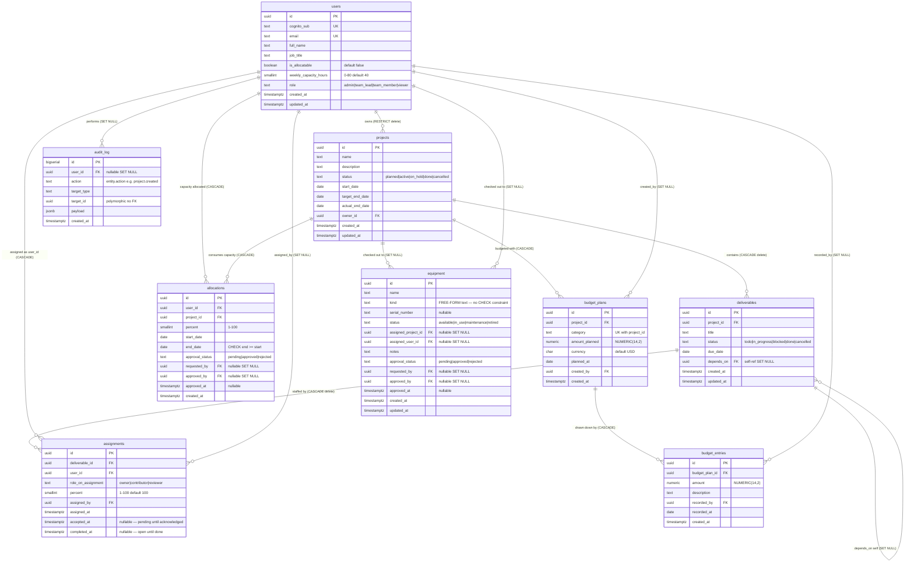
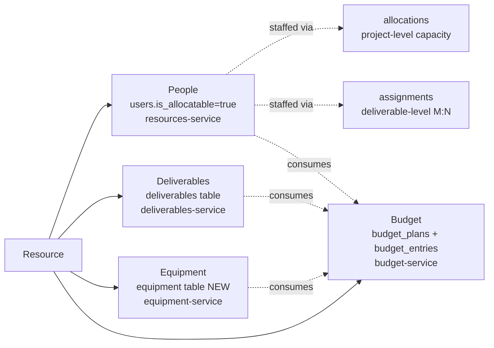
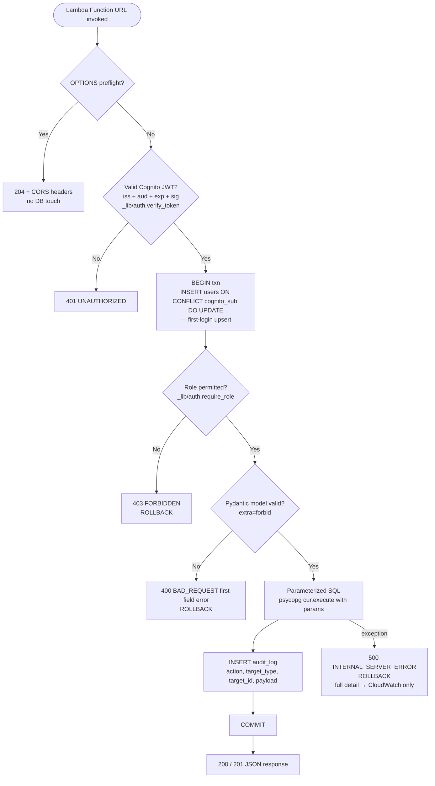
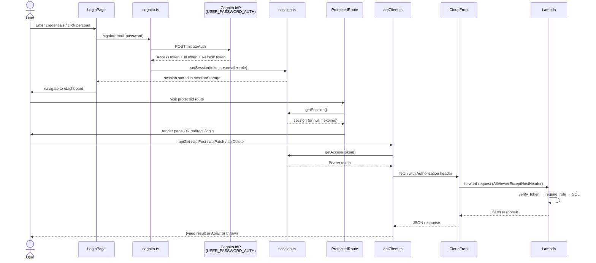

# ACME Project Tracker — Flow Diagrams

> **v1.3 — Approvals & free-form taxonomy.** Team members can now self-request
> allocations (join a project) and propose any kind of equipment; team leads
> approve or reject each request. The `equipment.kind` column is free-form
> (no CHECK constraint) so any tangible asset works. Migration 003 also
> back-fills `is_allocatable=true` for every team_lead / team_member /
> admin — fixing the empty "assign member" dropdown on new projects.
>
> **v1.2 — Resource taxonomy.** The "resources" concept is explicitly typed:
> **People** (`users`), **Deliverables** (`deliverables`), **Equipment** (`equipment`)
> and **Budget** (`budget_plans` + `budget_entries`). Each lives in its own
> table and has its own Lambda; the `/resources` UI surfaces the first three as
> tabs. Budget is project-scoped and lives under each project's detail page.

## 1. Database Flow

The diagram below shows the complete data model: every table, its primary/foreign-key relationships, the cascade/restrict rules, and which Lambda services write to which tables.



### Resource taxonomy at a glance



### Per-request database flow (every Lambda write)



---

## 2. UI Experience Flow

The diagram below traces every path a user can take through the React SPA — from first load through authentication, role-gated navigation, and each major feature area.

```mermaid
flowchart TD
    Browser([User opens browser]) --> LAND[/ LandingPage /\npublic — health-check ping]

    LAND --> LOGIN_NAV[Navigate to /login]
    LOGIN_NAV --> LOGIN[LoginPage\nUSER_PASSWORD_AUTH via cognito.ts\ndirect POST to Cognito IdP endpoint]

    LOGIN --> PERSONA{One-click persona\nor manual form?}
    PERSONA -- One-click --> SIGN[signIn persona.email + Workshop!2026]
    PERSONA -- Manual --> SIGN

    SIGN --> COGNITO[(Cognito User Pool\nInitiateAuth)]
    COGNITO -- Auth failure --> ERR[Show error alert\nstay on /login]
    COGNITO -- Success --> SESSION[setSession in sessionStorage\naccessToken + idToken + expiresAt\nemail decoded from JWT\nrole derived from email]

    SESSION --> RETURN{Was there a\nreturnTo path?}
    RETURN -- Yes --> RESTORE[Navigate to original path]
    RETURN -- No --> DASH

    RESTORE --> GUARD

    GUARD[ProtectedRoute\ngetSession + check expiry] --> ROLE_CHECK{Role permitted\nfor this route?}
    ROLE_CHECK -- Not authed --> LOGIN_NAV
    ROLE_CHECK -- Wrong role --> DASH
    ROLE_CHECK -- OK --> PAGE

    DASH[/dashboard\nDashboardPage\nall roles] --> API_DASH[apiGet /projects-service?limit=100\napiGet /reports-service/at-risk]
    API_DASH --> CARDS[Render summary cards:\nProject count · At-risk count · Reports link]

    PAGE --> DASH
    PAGE --> PROJ[/projects\nProjectsListPage\nall roles]
    PAGE --> PROJ_NEW[/projects/new\nProjectCreatePage\nadmin + team_lead only]
    PAGE --> PROJ_DET[/projects/:id\nProjectDetailPage\nall roles]
    PAGE --> RES[/resources\nResourcesPage — tabbed\nall signed-in roles]
    PAGE --> REP[/reports\nReportsPage\nall roles]
    PAGE --> ADMIN[/admin\nAdminPage\nadmin only]

    PROJ --> API_LIST[apiGet /projects-service\n?status= &owner_id= &q= &at_risk=\nSearch + filter + pagination]

    PROJ_NEW --> FORM_NEW[Fill project form\nname · status · dates · description]
    FORM_NEW --> API_POST[apiPost /projects-service]
    API_POST --> PROJ

    PROJ_DET --> TABS{Active tab}
    TABS -- Overview --> OVER[apiGet /projects-service/:id\nDisplay metadata]
    TABS -- Deliverables --> DEL_PANEL[DeliverablesPanel\napiGet /deliverables-service?project_id=]
    TABS -- Allocations --> ALLOC_PANEL[AllocationsPanel\napiGet /allocations-service?project_id=]
    TABS -- Budget --> BUD_PANEL[BudgetPanel\napiGet /budget-service?project_id=]

    DEL_PANEL --> DEL_WRITE[POST /deliverables-service\nadmin · owning team_lead · team_member allocated to project\nteam_member posts are forced status=todo pending approval]
    DEL_PANEL --> DEL_STATUS[PATCH /deliverables-service/:id\nstatus — assignee or lead/admin]
    ALLOC_PANEL --> ALLOC_WRITE[POST/DELETE /allocations-service\nadmin + owning team_lead\n— this is how team leads assign team members to projects]
    ALLOC_PANEL --> ASSIGN_WRITE[POST /assignments-service\nadmin + owning team_lead\n— assign members to specific deliverables]
    BUD_PANEL --> BUD_WRITE[POST /budget-service/:id/entries\nadmin + owning team_lead]

    RES --> RES_TABS{Resource tab}
    RES_TABS -- People --> RES_PEOPLE[apiGet /resources-service\nusers WHERE is_allocatable=true\nread: all roles · write: admin only]
    RES_TABS -- Deliverables --> RES_DEL[apiGet /deliverables-service?limit=100\ncross-project read · link to project detail]
    RES_TABS -- Equipment --> RES_EQ[apiGet /equipment-service\nlaptops · vehicles · licenses · rooms · other\nread: all · create/update: admin + team_lead · delete: admin]

    REP --> API_REP[apiGet /reports-service/at-risk\n/over-allocated · /over-assigned\n/allocation-by-user · /deliverable-completion\n/budget-vs-planned · /deliverable-chain]

    ADMIN --> API_ADMIN[apiGet /resources-service\nUser management — admin only]

    SESSION --> EXPIRE{Token expired\non next getSession?}
    EXPIRE -- Yes --> LOGIN_NAV

    CARDS --> SIGN_OUT[User signs out\nclearSession removes sessionStorage key]
    SIGN_OUT --> LAND
```

### Auth token flow (detail)



---

## 3. Permission Matrix (v1.3)

Who can do what to each resource type. The frontend gates UI affordances; the
backend (`backend/_lib/auth.py` + per-service `require_role` / ownership
checks) re-enforces every rule. Rows marked **pending → lead approves** carry
an `approval_status` of `pending` until an admin or owning team_lead PATCHes
it to `approved` or `rejected`.

| Resource | Read | Create | Update | Delete |
|---|---|---|---|---|
| **People** (`users` via `resources-service`) | all roles · `GET /me` returns own row | (Cognito sign-up; admin/lead/member auto-flagged `is_allocatable`) | admin only | n/a |
| **Projects** | all roles | admin, team_lead | admin, owning team_lead | admin only |
| **Deliverables** | all roles | admin, owning team_lead, **team_member allocated to project** (forced `status=todo` — pending lead approval) | admin, owning team_lead, assignee (status only) | admin, owning team_lead |
| **Assignments** (deliverable ↔ user) | all roles | admin, owning team_lead | admin, owning team_lead (reassign); assignee (`accepted_at`/`completed_at` only) | admin, owning team_lead |
| **Allocations** (self-join a project) | all roles | admin/lead → `approved` immediately. **team_member → self-only, `pending` → lead approves** | admin, owning team_lead (incl. `approval_status`) | admin, owning team_lead; team_member may **withdraw own pending** |
| **Equipment** (any tangible asset, free-form `kind`) | all roles | admin/lead → `approved`. **team_member → `pending` → lead approves** | admin, team_lead (incl. `approval_status`) | admin; team_member may **withdraw own pending** |
| **Budget plans + entries** | all roles | admin, owning team_lead | (plans immutable) | admin only |
| **Reports** | all roles | n/a | n/a | n/a |
| **Admin / user management** | admin only | admin only | admin only | admin only |

### Approval workflow (sequence)

```mermaid
sequenceDiagram
    actor TM as Team Member
    actor TL as Team Lead
    participant API as Lambda<br/>(allocations / equipment)
    participant DB as Postgres

    TM->>API: POST {project_id, …} (no user_id)
    API->>API: current_user → team_member<br/>force user_id=self, approval_status='pending'
    API->>DB: INSERT … approval_status='pending', requested_by=TM
    DB-->>API: row
    API-->>TM: 201 Created (pending)

    Note over TL: Lead opens AllocationsPanel /<br/>Equipment tab; sees pending badge
    TL->>API: PATCH /<id> {approval_status: 'approved'}
    API->>API: current_user → team_lead + owns project<br/>stamp approved_by=TL, approved_at=now
    API->>DB: UPDATE … approval_status='approved'
    DB-->>API: row
    API-->>TL: 200 OK
```

### Key behavioural changes from v1.2 → v1.3

1. **Empty "assign member" dropdown is fixed.** Migration 003 sets
   `is_allocatable=true` for every admin/team_lead/team_member, and
   `_lib/auth._ensure_user` does the same on first login going forward. The
   AllocationsPanel picker on `/projects/:id` is now populated, and team
   leads + team members both appear on the People resource tab.
2. **Team members can join any project (self-request).** New form in the
   AllocationsPanel for `role=team_member`: percent + date range only,
   `user_id` is filled in by the backend. Lands as `approval_status=pending`
   with a badge. Lead/admin sees Approve / Reject buttons; member can
   Withdraw their own pending request.
3. **Team members can propose any equipment.** Same approval flow on the
   Equipment tab: free-form `kind`, `name`, `status`; lands as pending; lead
   approves or rejects.
4. **`equipment.kind` is free-form.** Migration 003 drops the CHECK
   constraint. The UI offers a datalist of `COMMON_EQUIPMENT_KINDS` + every
   kind currently in the table (via `GET /api/equipment-service/kinds`) as
   *suggestions only* — any non-empty short label is accepted.
5. **`GET /api/resources-service/me`** returns the caller's own row so the
   frontend `useCurrentUser` hook can recognise self-allocated rows.

